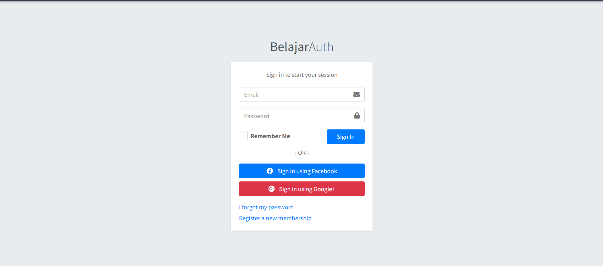
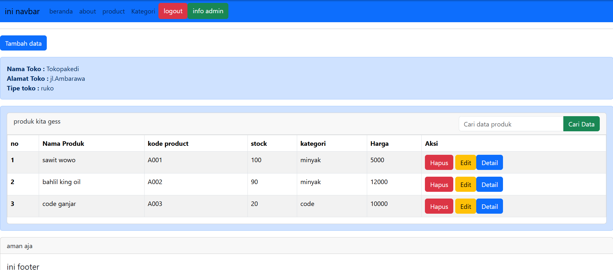

# Laravel Basic CRUD Practice

Repository ini dibuat sebagai bahan latihan untuk memahami struktur dan alur kerja Laravel.
Project ini menggunakan Laravel tanpa tambahan package eksternal (pure Laravel) untuk fokus memahami konsep dasarnya.

## Tujuan Project

* Memahami struktur project Laravel
* Memahami konsep MVC (Model-View-Controller)
* Melatih implementasi CRUD menggunakan Laravel

## Yang Dipelajari

* Routing
* Controller
* Model
* View
* Blade Templating
* Eloquent ORM
* MVC Pattern
* Methods
* Compact Function
* Migration
* Seeder (Data dummy)
* Auth

## Fitur

* Create data
* Read data
* Update data
* Delete data
* Search data
* login
* logout
## Teknologi

* Laravel
* Laravel Sail (Docker-based development environment)

## Catatan

Project ini dibuat untuk latihan memahami fundamental Laravel sebelum menggunakan package tambahan seperti Filament atau package lainnya.

## Documentation

### Login

     

### Dashboard

     

### CRUD Page

     

## References
* https://youtube.com/playlist?list=PLPqeNG7ba3a_Sz3tJ1YukfqHE5jZGBmHn&si=NnEcDC5qoXL6Apwn
* https://youtube.com/playlist?list=PLBs-bxLCgCx-emg0XfU2AXDCsjyppJmFY&si=hB_WTggw2qqSPPUc
